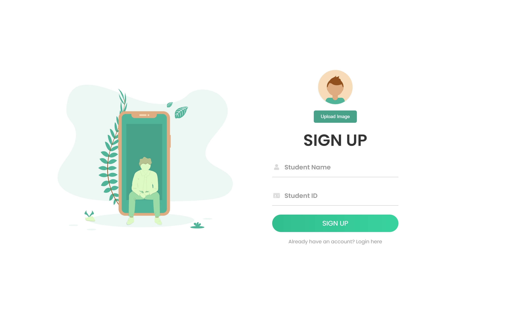
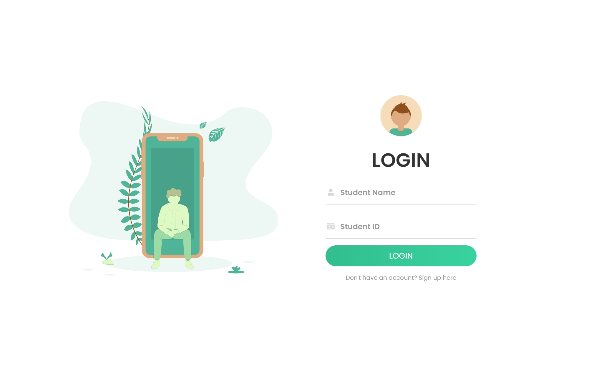
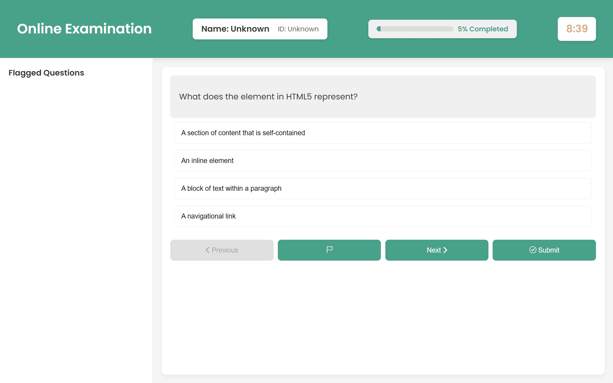
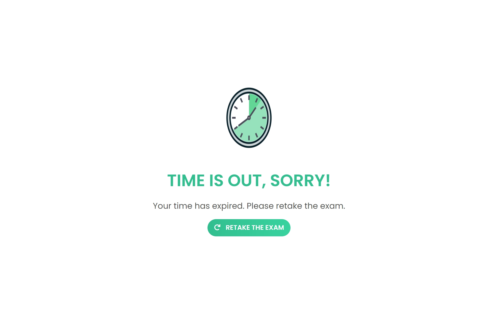

# **Online-Exam-Platform_DEBI-Project**

A modern, responsive online exam platform featuring sign-up/login functionality, timed exams, progress tracking, flagged questions, and result submission. Built with **HTML**, **CSS**, and **JavaScript** for an interactive and user-friendly experience.

## Features

- **User Authentication**: Sign-up and login functionality with form validation.
- **Timed Exams**: A countdown timer to ensure users complete the exam within a specified duration.
- **Progress Tracking**: Real-time progress bar showing the percentage of the exam completed.
- **Question Flagging**: Users can flag questions for review and return to them later.
- **Result Submission**: Displays the final exam score along with the user's name and ID.

## Technologies Used

- **HTML5**: For the structure of the web pages.
- **CSS3**: For styling, animations, and layout, ensuring a responsive design.
- **JavaScript**: For handling dynamic functionality such as form validation, quiz logic, and data storage using `localStorage`.

## Screenshots

### Sign-Up Page


### Login Page


### Welcome Page


### Exam Page


### Result Page


### Time-Out Page


## Project Structure

### HTML Files:

- **`index.html`**: Handles user sign-up and login.
- **`welcome.html`**: Introduction page that starts the exam.
- **`exam.html`**: Main exam page where users answer questions and track their progress.
- **`timeout.html`**: Displays a timeout message when the exam time expires.
- **`result.html`**: Shows the user's final score after the exam.

### Styles:

- **`main.css`**: Global styling useing throughout the project.
- **`signup-login-form.css`**: Styles specific to the sign-up and login forms.
- **`exam.css`**: Styling for the main exam interface, including the question container, progress bar, and flagged questions.
- **`timeout.css`**: Styling for the timeout page that shows when the exam time expires.
- **`result.css`**: Styling for the result page that displays the user's score.
- **`welcome.css`**: Styling for the welcome page that displays the welcome message for the user.

### JavaScript Files:

- **`signupLoginForm.js`**: Handles form validation for the sign-up and login process.
- **`exam.js`**: Core functionality for managing the exam questions, flagging, timer, and result calculation.
- **`result.js`**: Displays the user's exam result using data from `localStorage`.
- **`goBackButtonDisable.js`**: Prevents users from going back during the exam.

## How to Run the Project

1. **Clone the repository**:
   ```bash
   git clone https://github.com/MoSalem149/Online-Exam-Platform_DEBI-Project.git
